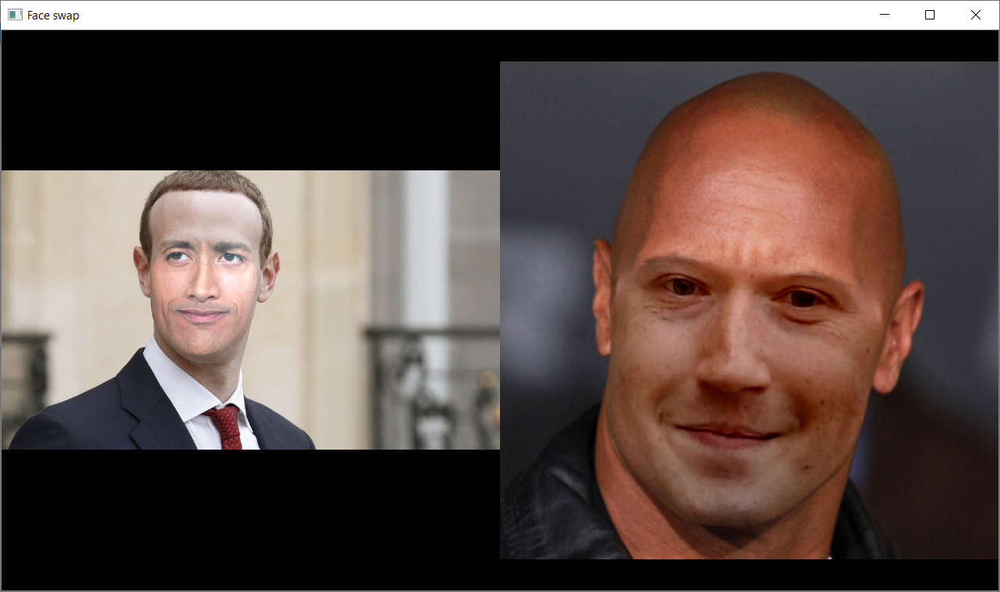

# Face swap application

Desktop application for face swapping implemented using Python and OpenCV as part of Pattern Recognition course.

Implemented face swapping approaches were based on descriptions in https://cmsc733.github.io/2019/proj/p2/.

## Features

 - Two modes: image and camera. Image mode loads both images from a directory while camera mode uses web camera input as first image.
 - Two face landmark detectors: dlib and 3DDFA_V2,
 - Two warping methods: affine transformation and thin plate spline.
 - Display of face bounding rectangles, landmarks, triangles and swapped faces can be toggled using hotkeys.
 
**Hotkeys:**

[C] Switch between modes

[D] Switch between landmark detectors

[W] Switch between warping methods

[R] Toggle display of rectangles

[L] Toggle display of landmarks

[T] Toggle display of triangles in affine mode

[1] Toggle swap for first image

[2] Toggle swap for second image

[Down] Previous first image

[Up] Next first image

[Left] Previous second image

[Right] Next second image

## How to run

For dlib landmark detection to work you need to put trained dlib model `shape_predictor_68_face_landmarks` in `dlib_data` folder. You can find it [here](http://dlib.net/files/shape_predictor_68_face_landmarks.dat.bz2).

For 3DDFA_V2 detection you need to put cloned [repo](https://github.com/cleardusk/3DDFA_V2) into `tddfa_v2` folder and build it according to instructions for your platform. Then you should edit `configs/mb1_120x120.yml` by prefixing `checkpoint_fp` and `bfm_fp` paths with `tddfa_v2/`. 

## Screenshots

## P. S.

Since this application was created by (ab)using OpenCV HighGUI for window and keyboard presses handling, the event handling code is pretty bad. In more serious GUI application it would be much better to use tools like PyQt.